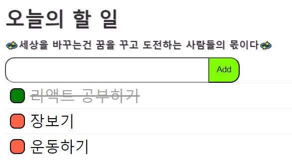

# 후츠릿 React 4주완성 스터디😀
> ### 💫세상을 바꾸는건 꿈을 꾸고 도전하는 사람들의 몫이다💫
 

## \* 배운것

> dom제어, 배열함수, 이벤트연결, 배열에 객체 추가하기!!
 

## 1. 투두리스트

    

> 
바닐라 자바스크립트를 사용, 투두리스트 만들기 실습!!

 

## 2. 구현기능

<ol>
    <li>투두리스트 추가하기</li>
    <li>투두리스트 완료</li>
    <li>투두리스트 삭제</li>
</ol>
 

## 3. 나만의 투두리스트를 만들어 보세요!

> [make todo list](https://sseon000.github.io/Studychutzrit/) <b>투두리스트 만들어보기
